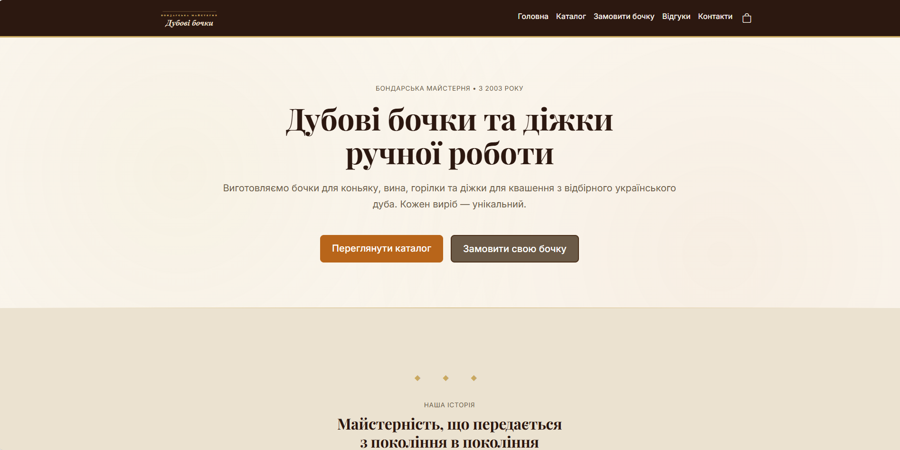
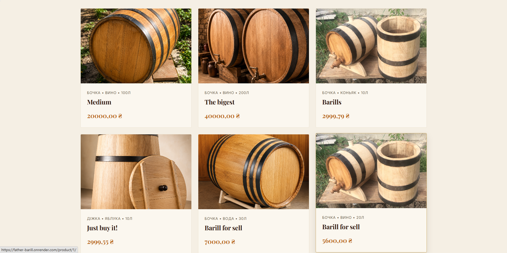
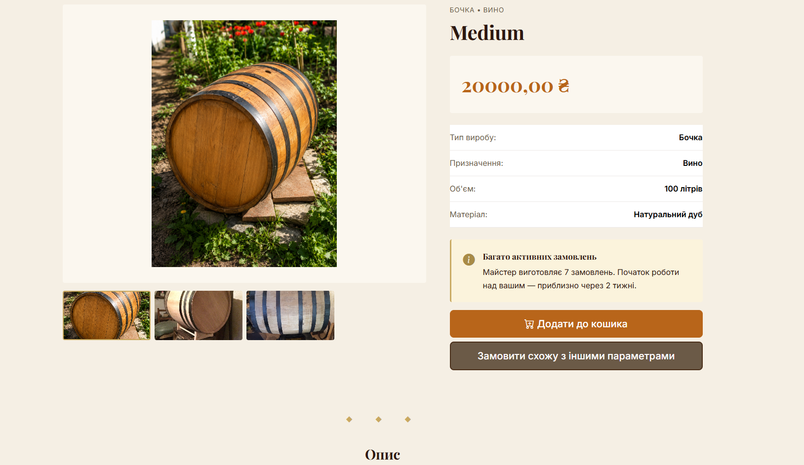
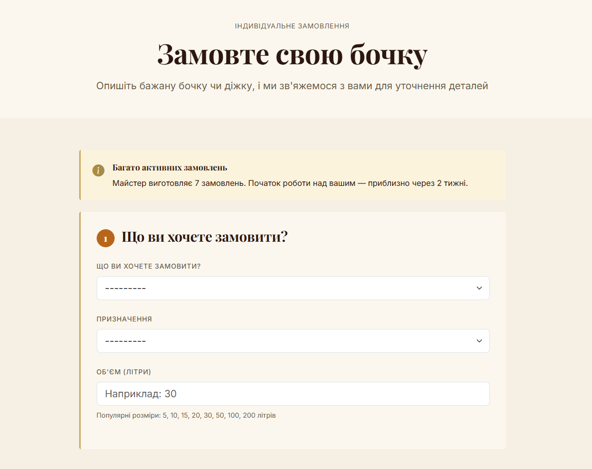
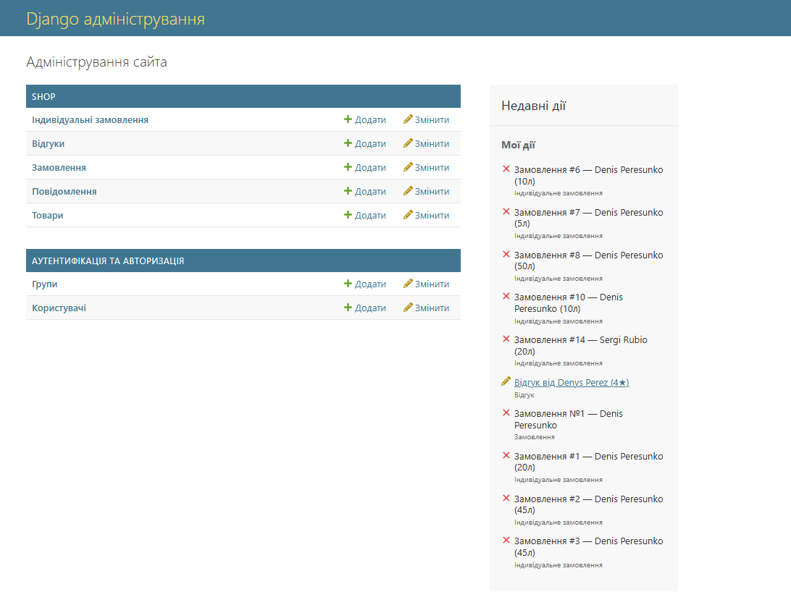

<div align="center">

# 🛢️ Дубові бочки — Oak Barrel Workshop

**A full-stack e-commerce platform for a family-run Ukrainian cooperage business, handcrafting oak barrels and pickling vats since 2003.**

[](https://www.djangoproject.com/)
[](https://www.python.org/)
[](https://www.postgresql.org/)
[](https://cloudinary.com/)
[](https://render.com/)

[**🌐 Live Demo**](https://father-barill.onrender.com) · [Features](#-features) · [Tech Stack](#-tech-stack) · [Screenshots](#-screenshots) · [Setup](#-local-setup)

</div>

---

## 📖 About

This project started as a way to help my father's real cooperage workshop — **"Дубові бочки" (Oak Barrels)**, based in Talne, Ukraine — take orders online instead of relying entirely on word of mouth. It's now a fully deployed, production e-commerce platform handling real customers, real orders, and real photos of handmade barrels and pickling vats.

Every product on the site is genuinely handcrafted by my father, a third-generation cooper. Building this taught me far more about production Django, cloud infrastructure, and debugging real-world deployment issues than any tutorial could.

## ✨ Features

- 🛒 **Full shopping flow** — catalog with filters (type, purpose, sorting), session-based cart, checkout
- 🔨 **Custom order constructor** — customers can request bespoke barrels/vats with their own specs
- 💳 **LiqPay payment integration** (sandbox) — signed webhook verification, async payment confirmation flow
- 🚚 **Nova Poshta API integration** — live city & warehouse autocomplete for delivery
- ⭐ **Moderated reviews system** — customer reviews with admin approval workflow
- 📧 **Transactional email notifications** via Resend API — new orders, reviews, and contact messages
- 🖼️ **Cloud media storage** — Cloudinary integration for product photos, resilient to ephemeral filesystem on Render
- 📊 **Order queue system** — visual warnings when the workshop's order backlog grows (5/10/20 thresholds)
- 🌐 **SEO-ready** — meta tags, sitemap.xml, robots.txt, Open Graph image
- 🔒 **Production-hardened security** — HSTS, secure cookies, SSL redirect, rotated secrets

## 🛠️ Tech Stack

| Layer | Technology |
|---|---|
| **Backend** | Django 6.0, Python 3.13 |
| **Database** | PostgreSQL (production) / MySQL (local dev) |
| **Media Storage** | Cloudinary |
| **Static Files** | WhiteNoise (compressed manifest storage) |
| **Payments** | LiqPay API |
| **Shipping** | Nova Poshta API |
| **Email** | Resend (via django-anymail) |
| **Hosting** | Render (Web Service + PostgreSQL) |
| **Frontend** | Django Templates, Bootstrap 5, vanilla JS |

## 🖼️ Screenshots

<div align="center">

### Homepage


### Product Catalog


### Product Detail Page


### Custom Order Builder


### Admin Panel


</div>

## 🏗️ Architecture Highlights

A few production challenges solved along the way that I'm proud of:

- **Django 6 storage migration** — diagnosed and fixed a silent `collectstatic` failure caused by the legacy `STATICFILES_STORAGE` string setting being deprecated in favor of the new `STORAGES` dict format, while keeping backward compatibility for `django-cloudinary-storage`'s custom management command.
- **SMTP → HTTP API migration** — discovered that Render blocks outbound SMTP ports (25/465/587) as an anti-spam measure, causing worker timeouts on every order. Migrated to Resend's HTTPS-based email API via `django-anymail`, plus wrapped all mail sending in a fail-safe helper so a flaky email provider never breaks the checkout flow.
- **Ephemeral filesystem handling** — Render's filesystem resets on every deploy, so uploaded product photos were vanishing. Fixed by properly wiring Cloudinary as the `default` file storage backend under Django 6's new `STORAGES` format.
- **Free-tier database expiry** — Render's free PostgreSQL instances auto-expire after 30 days; documented the recreation process and connection string (external vs. internal URL) gotchas for future reference.

## 🚀 Local Setup

```bash
# Clone the repo
git clone https://github.com/denis-proga/father-barill.git
cd father-barill

# Create and activate a virtual environment
python -m venv venv
venv\Scripts\activate  # Windows
# source venv/bin/activate  # macOS/Linux

# Install dependencies
pip install -r requirements.txt

# Copy environment variables template and fill in your own values
cp .env.example .env

# Run migrations
python manage.py migrate

# Start the development server
python manage.py runserver
```

Visit `http://127.0.0.1:8000` to see it running locally.

### Environment Variables

See `.env.example` for the full list. You'll need your own API keys for:
- LiqPay (sandbox keys are free to generate)
- Cloudinary (free tier available)
- Nova Poshta (free API key)
- Resend (free tier: 3,000 emails/month)

## 📄 License

This is a personal/family project built for portfolio and educational purposes.

---

<div align="center">

Built with ❤️ by [Denis Peresunko](https://github.com/denis-proga) — a second-year Web Application Development student, for his father's real cooperage workshop.

</div>
